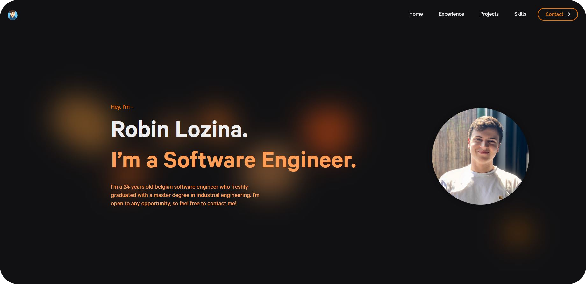

# Portfolio

## Overview

**Portfolio** is a personal website designed to showcase my projects, skills, and achievements in web development. This website provides a clean, user-friendly interface for visitors to explore my work and get in touch.

<p align="center">
	
</p>

## Accessing the Portfolio

- The website is online at the address : **[robinlozina.com](https://www.robinlozina.com/)**.

## How to Run Locally

```sh
   git clone https://github.com/robinlozina/portfolio.git
	cd portfolio
```
